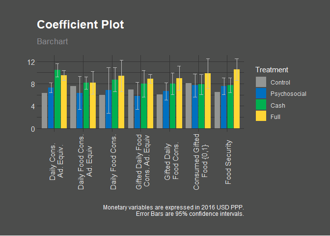
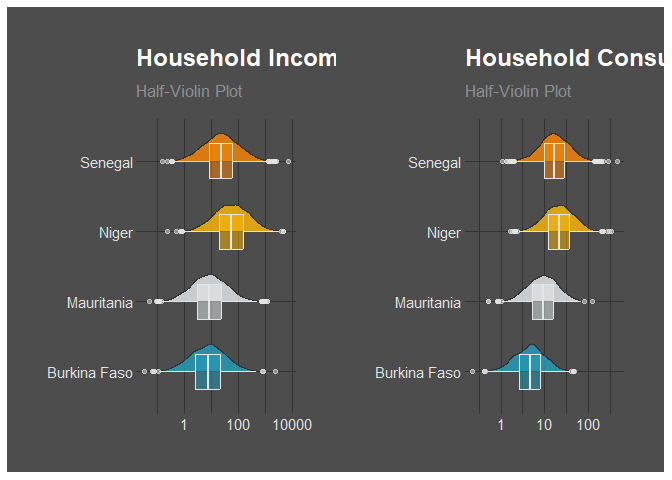
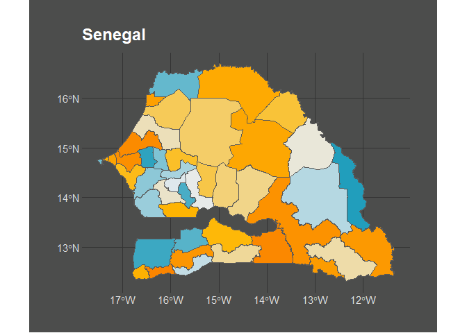
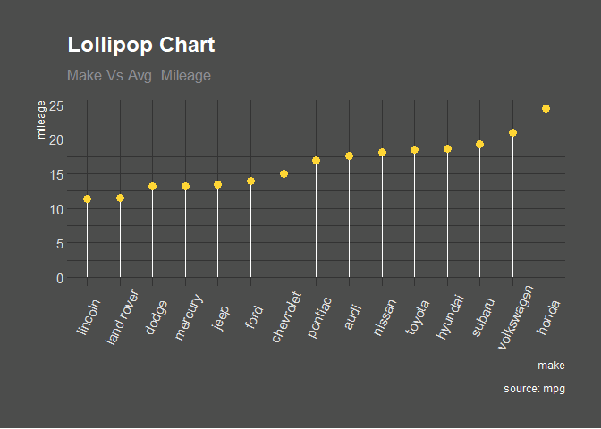
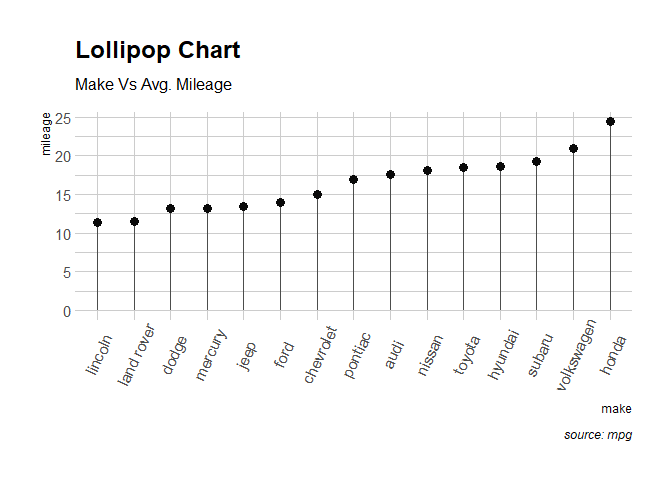

<!-- README.md is generated from README.Rmd. Please edit that file -->

# SahelGraphR 

<!-- badges: start -->

[](https://lifecycle.r-lib.org/articles/stages.html#experimental)
<!-- badges: end -->

`{SahelGraphR}` is a package aimed at providing functions to speed up
the production of graphs (and maybe tables in the future?) of the Sahel
ASP RCT evaluation by DIME.

## Installation

You can install the development version of SahelGraphR from
[GitHub](https://github.com/) with:

``` r
# install.packages("devtools")
devtools::install_github("BBieri/SahelGraphR")
```

## Graphs

`{SahelGraphr}` contains functions and wrappers to rapidly produce
consistent graphs across the four countries.

### Coefficient Graph



### Distribution Graphs

Distribution graphs allow users to visualize the common support of
distributions. Visit the package site for more options.



## Maps

`{SahelGraphR}` includes a helper function to download (sub-)national
shapefiles from [HDX](https://data.humdata.org/) for easy and fast
mapmaking in R of the four countries in the RCT.

    #> Departement Level Selected



## Themes

This package also contains two themes for the production of `{ggplot2}`
graphs for the Sahel ASP graphs.

### Dark theme:

Here is an example graph using the dark theme:

``` r
library(SahelGraphR)
## basic example code
library(ggplot2)
  # Prepare data
cty_mpg <-
  aggregate(mpg$cty, by = list(mpg$manufacturer), FUN = mean)  # aggregate
colnames(cty_mpg) <- c("make", "mileage")  # change column names
cty_mpg <- cty_mpg[order(cty_mpg$mileage),]  # sort
cty_mpg$make <- factor(cty_mpg$make, levels = cty_mpg$make)
# Plot
ggplot(cty_mpg, aes(x = make, y = mileage)) +
  geom_segment(aes(
    x = make,
    xend = make,
    y = 0,
    yend = mileage
  ), color = "white") +
  geom_point(size = 3, color = SahelGraphR::asp_palettes$Dark[["yellow-full"]]) +
  labs(title = "Lollipop Chart",
       subtitle = "Make Vs Avg. Mileage",
       caption = "source: mpg") +
  SahelGraphR::themeaspdark() +
  theme(axis.text.x = element_text(angle = 65, vjust = 0.6))
```



### Light theme:

Here is an example graph using the light theme:

``` r
library(SahelGraphR)
## basic example code
library(ggplot2)
  # Prepare data
cty_mpg <-
  aggregate(mpg$cty, by = list(mpg$manufacturer), FUN = mean)  # aggregate
colnames(cty_mpg) <- c("make", "mileage")  # change column names
cty_mpg <- cty_mpg[order(cty_mpg$mileage),]  # sort
cty_mpg$make <- factor(cty_mpg$make, levels = cty_mpg$make)
# Plot
ggplot(cty_mpg, aes(x = make, y = mileage)) +
  geom_segment(aes(
    x = make,
    xend = make,
    y = 0,
    yend = mileage
  ), color = "#4c4d4c") +
  geom_point(size = 3, color = SahelGraphR::asp_palettes$Light[["anthracite-full"]]) +
  labs(title = "Lollipop Chart",
       subtitle = "Make Vs Avg. Mileage",
       caption = "source: mpg") +
  SahelGraphR::themeasplight() +
  theme(axis.text.x = element_text(angle = 65, vjust = 0.6))
```


